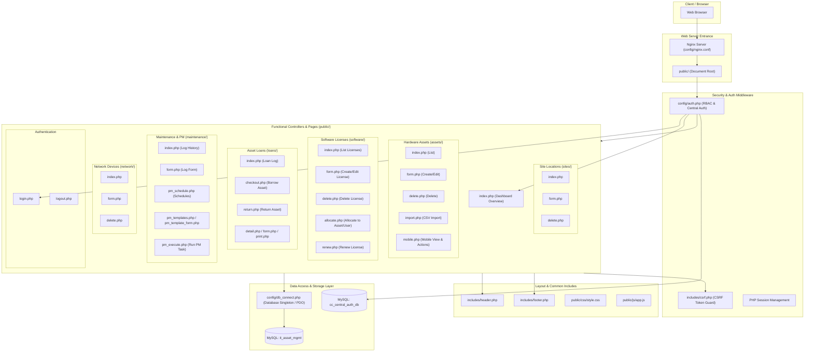
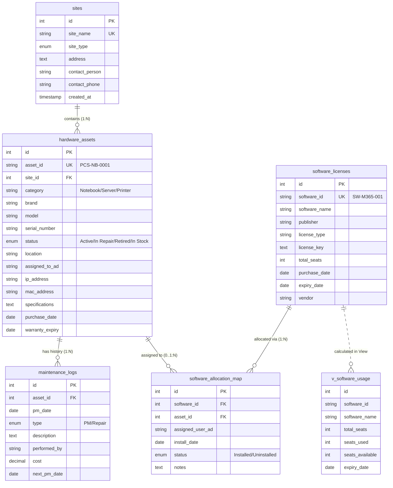
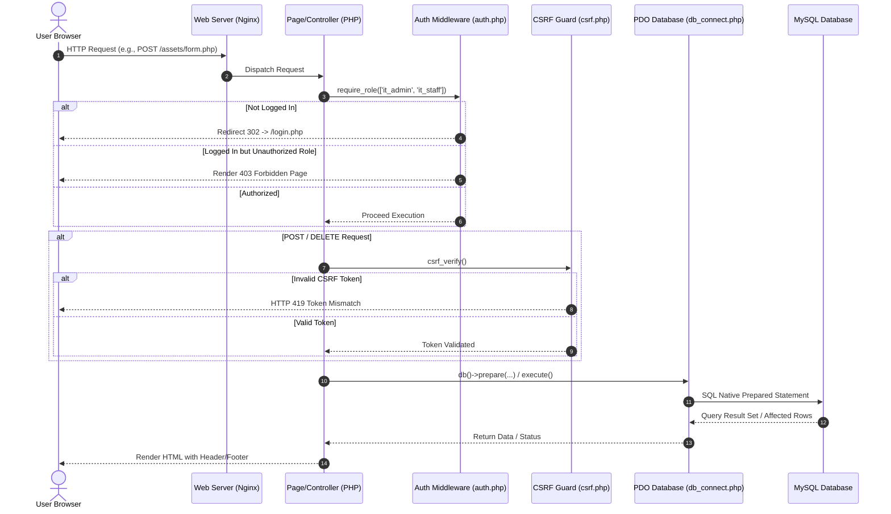
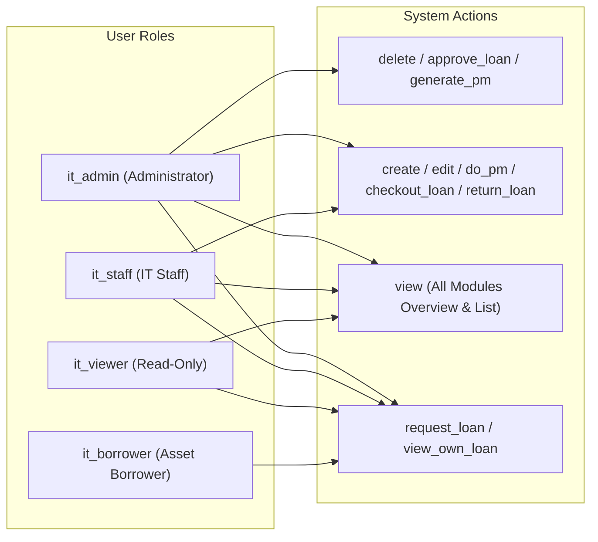

# โครงสร้างโปรเจกต์ Pacific Cold Storage — IT Asset Management System

เอกสารนี้รวบรวมไดอะแกรมสถาปัตยกรรมระบบ, โครงสร้างฐานข้อมูล (ERD), Data & Request Flow, และระบบสิทธิ์การใช้งาน (RBAC) ของโปรเจกต์ **IT Asset Manager** (`/var/www/lab/it-asset-manager`) ในรูปแบบ **Mermaid.js**

---

## 1. โครงสร้างโมดูลและสถาปัตยกรรมระบบ (Project Architecture Diagram)

ไดอะแกรมแสดงการจัดวางไฟล์, โครงสร้างโฟลเดอร์ และความสัมพันธ์ระหว่าง Presentation Layer, Middleware/Config Layer และ Database

---

## 2. แผนผังความสัมพันธ์ของฐานข้อมูล (Database ER Diagram)

อ้างอิงจาก schema ใน `sql/database.sql` แสดงความสัมพันธ์แบบ Foreign Key ระหว่างตารางต่างๆ

---

## 3. ลำดับการประมวลผลคำขอ (Request & Authentication Flow)

แสดงลำดับขั้นตอนเมื่อผู้ใช้ส่งคำขอ (HTTP Request) เข้าสู่ระบบ ตั้งแต่ผ่าน Auth Middleware, ตรวจสอบ CSRF จนถึงการประมวลผล PDO SQL

---

## 4. ผังการจัดสิทธิ์ใช้งาน (Role-Based Access Control - RBAC Matrix)

สิทธิ์การใช้งานตามบทบาทใน `config/auth.php` ผ่านฟังก์ชัน `can($action)`

---

## สรุปส่วนประกอบหลักของโค้ดในโปรเจกต์

1. **การเชื่อมต่อฐานข้อมูล**: `config/db_connect.php` ใช้รูปแบบ Singleton PDO Pattern ป้องกัน SQL Injection ด้วย Native Prepared Statement
2. **ระบบสิทธิ์และการยืนยันตัวตน**: `config/auth.php` รองรับ 4 ระดับสิทธิ์ (`it_admin`, `it_staff`, `it_viewer`, `it_borrower`) เชื่อมต่อกับระบบล็อกอินส่วนกลาง `cc_central_auth_db`
3. **การป้องกันความปลอดภัย**: `includes/csrf.php` มี `csrf_field()` และ `csrf_verify()` ป้องกัน CSRF Attack ในทุกฟอร์ม
4. **โมดูลหลักของระบบ**:
   - **Assets**: จัดการอุปกรณ์ฮาร์ดแวร์, นำเข้าข้อมูล CSV และมีหน้าจอสำหรับอุปกรณ์เคลื่อนที่ (Mobile view)
   - **Software**: บันทึกและจัดสรรไลเซนส์ซอฟต์แวร์ (Software Allocation Map)
   - **Loans**: ระบบยืม-คืนอุปกรณ์ ไอที
   - **Maintenance & PM**: บันทึกการซ่อมบำรุง และวางแผนงาน Preventive Maintenance (PM)
   - **Sites & Network**: จัดการข้อมูลสาขาและอุปกรณ์เครือข่าย
